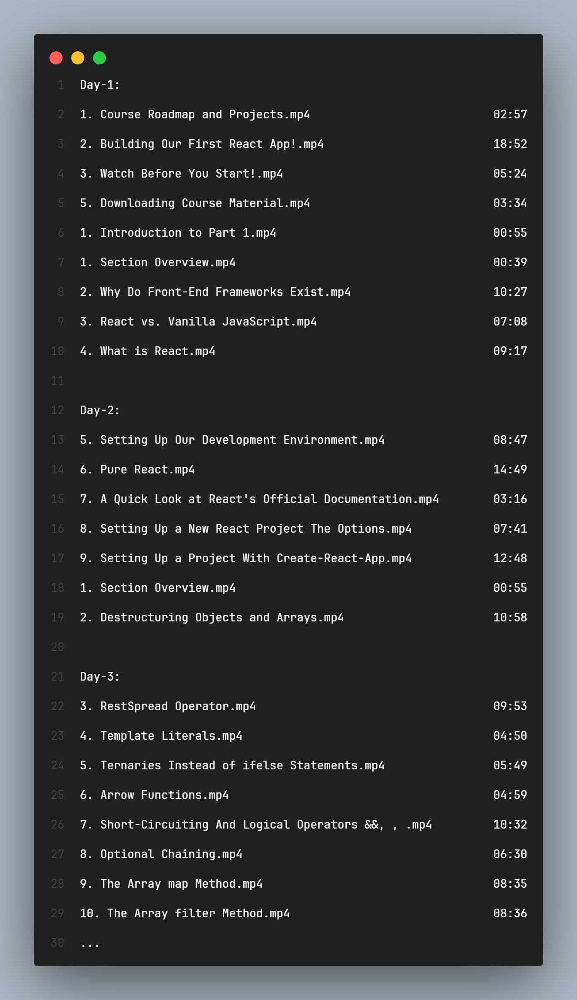

# Course Scheduler

### This project is designed to help manage and schedule courses efficiently using Node.js.

Currently you can schedule the courses only from your computer. Soon there will be a browser extension for udemy courses.

There is currently no api endoint available. You can clone the github repository and you can change the courseDirectory in app.js

_Example_

> const courseDirectory = "C:/Users/Public/Documents/ReactJSCourse";

and you can change the minutes in app.js according to your needs.

> const minutes = 3600;

### Output File

